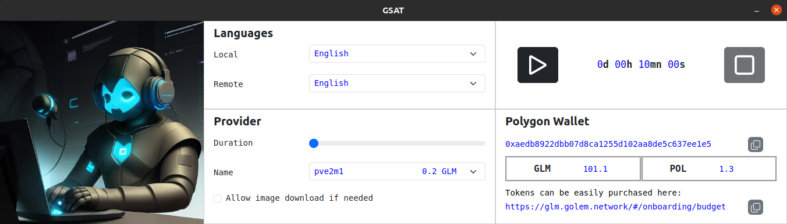
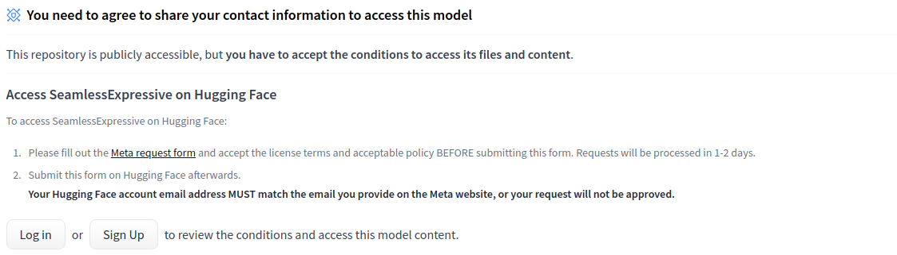
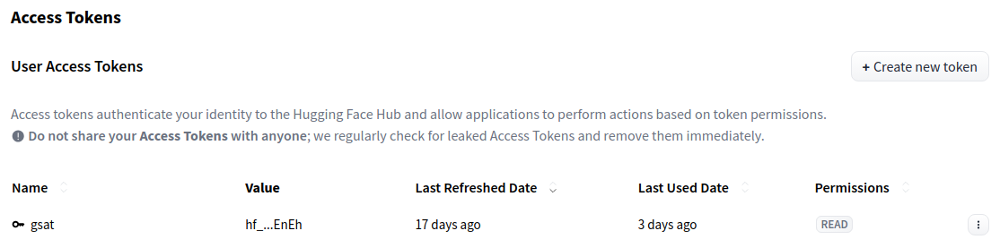
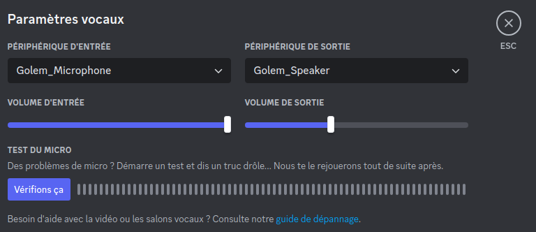
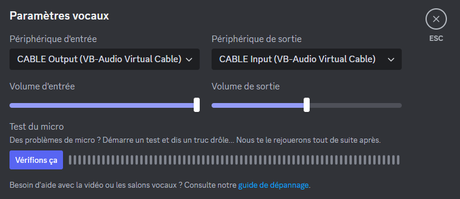
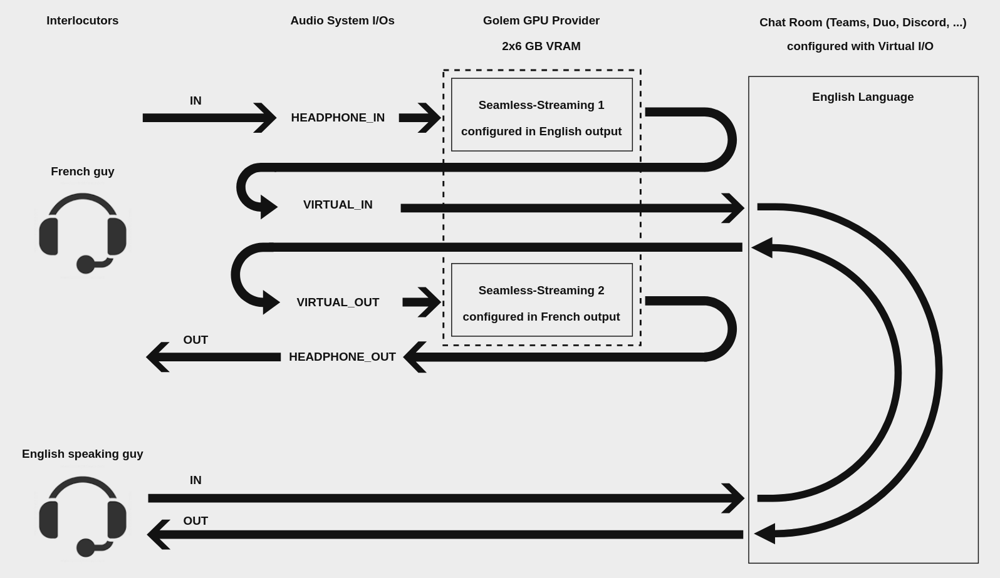

<h1 align="center"> GSAT </h1>

<p align="center">
 
</p>

GSAT allows you to converse with anyone regardless of their language.  
It runs on top of Golem Network and works with the usual chat tools like Discord, Teams, Duo, ...  
This software is available on Linux and Windows.  

Supported languages:  

     English, Arabic, Bengali, Catalan, Czech, Chinese, Welsh, Danish, German, Estonian,  
     Finnish, French, Hindi, Indonesian, Italian, Japanese, Korean, Maltese, Dutch,  
     Persian, Polish, Portuguese, Romanian, Russian, Slovak, Spanish, Swedish,  
     Swahili, Telugu, Tagalog, Thai, Turkish, Ukrainian, Urdu, Uzbek, Vietnamese 

This application is based on Meta's Seamless Communication AI models.  
Meta's model Seamless Expressive aims to preserve the subtleties of discourse such as pauses and speaking rate in addition to vocal style and emotional tone.  

<details>
<summary><h2>Requirements</h2></summary>

 - **Golem Requestor**  
     - Linux: https://github.com/norbibi/Linux_Golem_Requestor_Installer  
     - Windows: https://github.com/norbibi/Windows_Golem_Requestor_Installer  
 - **Audio virtual devices**
     - Linux: ```apt-get install pulseaudio-utils```
     - Windows: https://download.vb-audio.com/Download_CABLE/VBCABLE_Driver_Pack43.zip  
</details>
  
## How to use  
This software is in portable version, so, just download the zip archive corresponding to your architecture and extract it somewhere on your system.  
The binary file to launch is called GSAT(.exe).
    
:exclamation: **Use of the Seamless Expressive model is licensed.**  
So it is necessary to register on Huggingface, request access to the model and create an access token once approved.  
https://huggingface.co/facebook/seamless-expressive  
https://huggingface.co/settings/tokens  
  
<p align="center">
   
</p>

<p align="center">
  
</p>
  

and add it to your environment with HF_TOKEN variable.  
Without this token, the application will run correctly but the voices will be generic and monotonic.  
  
Echo cancellation has been disabled for performance purposes, so configure your system to use headset.  
Once started, select languages wanted for you and your interlocutor, wait for providers scan then select one, adjust duration and click on start button.  
The full duplex translation will be operational when the timer is launched and will stop when it expires or when you click on the stop button.  
You can now use the Golem_Speaker/Golem_Microphone (Linux) or CABLE_IN/CABLE_OUT (Windows) virtual audio devices in your favorite chat application.  
  
<p>
  
&nbsp; 
  
</p>
  
**Optional parameters can be passed to the application:**  
 - ***subnet***: default public, related to Golem Network.  
 - ***network***: default polygon, can be holesky.  
 - ***logLevel***: default none, can be child, debug, info, warn, error.  
 - ***hfToken***: will be used instead of environment variable if passed here.  
 - ***dbg***: switch to enable debug mode (show hidden window, enable SSH to provider, loopback from microphone to speaker).
  
Examples:
 - Linux: ```./GSAI --dbg --subnet=my_subnet --network=holesky --logLevel=debug --hfToken=my_token```  
 - Windows: ```GSAI.exe --dbg --subnet=my_subnet --network=holesky --logLevel=debug --hfToken=my_token```  
  
<details>
<summary><h2>How it works</h2></summary>
<p align="center">
 
</p>
</details>
  
<details>
<summary><h2>Build application (only dev)</h2></summary>

Build application process requires Node.js.
     
```
git clone https://github.com/norbibi/GSAT.git  
cd GSAT/GSAT  
npm ci
npm run make -- --platform win32
npm run make -- --platform linux
``` 
</details>

<details>
<summary><h2>Build GVMI image (only dev)</h2></summary>

Build GVMI process requires Docker and Python3 (gvmkit-build package).  
Uploading image to Golem registry (https://registry.golem.network) requires registration and repository creation.
     
```
git clone https://github.com/norbibi/GSAT.git  
cd GSAT  
docker build -t docker_gvmi_gsat:latest Docker_GVMI_GSAT  
gvmkit-build docker_gvmi_gsat --push-to [YOUR_USERNAME]/[YOUR_REPOSITORY]:[VERSION] --upload-chunk-size 30000000 --upload-workers 16
``` 
</details>
